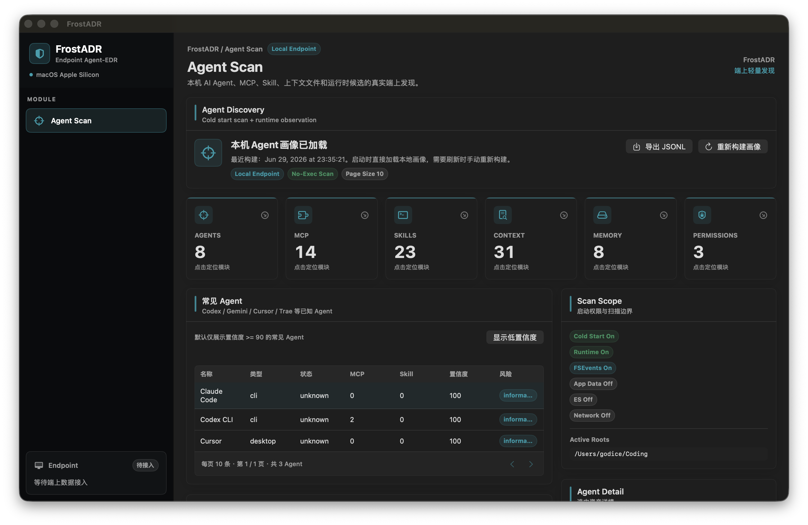

# FrostADR - macOS Agent-EDR for AI Agent Security


**FrostADR** is an endpoint-native **Agent Detection & Response / Agent-EDR** project for **macOS Apple Silicon**. It focuses on local AI agent security: discovering AI agents, MCP servers, skills, context files, memory files, runtime candidates, and risk signals directly on the endpoint.

FrostADR 是一款面向 macOS Apple Silicon 的端上 Agent Detection & Response（Agent-EDR）产品。它聚焦本机 AI Agent 的发现、画像、审计与风险线索收集，优先在本地完成轻量扫描与数据导出，为后续 MCP、Skill、上下文、Memory、策略与运行时防护能力预留扩展空间。

当前版本以 **Agent Scan** 为核心，提供本机 Agent 画像构建、常见 Agent 与自研 Agent 分组、MCP / Skill / Context / Memory 发现、指标卡快速跳转、长列表分页、Finder 路径定位，以及 JSONL 本地导出等基础能力。

如果你关注 **AI Agent security**, **LLM security**, **MCP security**, **prompt injection detection**, **macOS EDR**, **endpoint security**, **agent inventory**, or **local-first security tooling**，欢迎 Star 关注这个项目的持续演进。

## Screenshot



## Why FrostADR

AI coding agents and local assistants are becoming real endpoint actors. They can read workspaces, call tools, invoke MCP servers, write memory, execute commands, and touch sensitive files. Traditional EDR products usually observe processes and files, but they rarely understand agent-specific assets such as MCP configs, `SKILL.md`, `AGENTS.md`, `.cursor/rules`, session JSONL, tool schemas, and agent memory.

FrostADR explores an endpoint-native security layer for this new surface:

- Discover local AI agents without requiring manual path configuration.
- Inventory MCP servers, skills, context files, memory files, and runtime candidates.
- Keep scanning local-first, no-exec, and minimum-permission by default.
- Export normalized local evidence as JSONL for audit and debugging.
- Prepare for future detection, policy, approval, blocking, and session graph workflows.

## Current Features

- macOS SwiftUI native endpoint security interface.
- Agent Discovery for known and custom local agents.
- Common Agent and custom Agent grouping.
- MCP server config discovery without executing MCP server commands.
- Skill discovery and lightweight pre-scan signals.
- Context and Memory metadata discovery.
- Clickable metrics for quick navigation between modules.
- Fixed 10-row pagination across inventory and runtime status modules.
- Finder path reveal for Agent, MCP, Skill, Context, and Memory assets.
- Local JSONL export with Finder reveal.
- Default local-first, no-exec, minimum-permission discovery flow.

## Search Keywords

These are the main concepts FrostADR is designed around:

`AI agent security`, `Agent Detection and Response`, `Agent EDR`, `endpoint-native security`, `macOS EDR`, `macOS security`, `Apple Silicon security`, `LLM security`, `MCP security`, `Model Context Protocol security`, `MCP scanner`, `Skill scanner`, `prompt injection detection`, `tool poisoning detection`, `agent discovery`, `agent inventory`, `local-first security`, `SwiftUI security app`, `JSONL audit export`, `zero trust for AI agents`.

## Recommended GitHub Topics

For repository discovery, add these topics in GitHub's **About** sidebar:

`ai-agent-security`, `agent-edr`, `endpoint-security`, `macos-security`, `swiftui`, `apple-silicon`, `llm-security`, `mcp-security`, `model-context-protocol`, `mcp-scanner`, `prompt-injection`, `agent-discovery`, `ai-security`, `cybersecurity`, `edr`, `local-first`, `agent-inventory`, `skill-scanner`, `jsonl`, `zero-trust`.

Suggested repository description:

> Endpoint-native Agent-EDR for macOS Apple Silicon: discover local AI agents, MCP servers, skills, context and memory with local-first security.

See [GitHub SEO Checklist](docs/github-seo.md) for About sidebar, social preview, release title, and keyword maintenance notes.

## Architecture Direction

FrostADR is designed as an endpoint-first product:

- **UI:** macOS SwiftUI app.
- **Discovery:** known path fingerprints, config schema parsing, workspace scanning, process fingerprints, and runtime file observation.
- **Storage:** local SQLite-backed asset graph.
- **Export:** JSONL for audit portability.
- **Future endpoint modules:** policy engine, MCP wrapper, local LLM proxy, static scanner, approval workflow, session graph, and system telemetry.

## Discovery Validation

Run the discovery self-test and bundled app resource check:

```bash
Scripts/run_discovery_tests.sh
```

The script runs Agent Discovery self-tests, builds `dist/FrostADR.app`, verifies bundled fingerprint resources, and runs self-tests through the packaged app. Current checks cover MCP config detection and false-positive control, known agent fingerprints, workspace scanning, Skill script signals, discovery source markers, cold-start snapshot replacement, JSONL export integrity, path resolver behavior, and minimum-permission boundaries.

## Launch The macOS App

For the easiest local preview, double-click `FrostADR.command` in Finder. It builds a debug app bundle at `dist/FrostADR.app` and opens it.

From Terminal, run:

```bash
./FrostADR.command
```

To build a release app bundle for local use, double-click `PackageFrostADR.command` or run:

```bash
./PackageFrostADR.command
```

The reusable build script is:

```bash
Scripts/build_app.sh --debug --open
Scripts/build_app.sh --release
```

Generated build output lives under `dist/` and is intentionally not committed.

## Roadmap

- Broader Agent Discovery fingerprints for Claude Code, Cursor, Codex CLI, Gemini CLI, Continue, Cline / RooCode, OpenClaw, Aider, Trae, and custom agents.
- Richer static scanning for MCP configs, skills, context files, and memory files.
- Session graph reconstruction from observable agent, tool, process, file, and network events.
- Local policy evaluation, approval prompts, rewrite / block workflows, and audit timeline.
- Privacy-preserving local redaction before persistence or upload.

## Status

FrostADR is an early-stage macOS endpoint security project. The current app focuses on Agent Scan and local discovery scaffolding. Runtime enforcement, full Endpoint Security integration, Network Extension enforcement, MCP wrapping, and LLM proxy features are planned but not yet production-ready.

If this direction is useful to you, please Star the repository so more AI security and endpoint security builders can find it.
